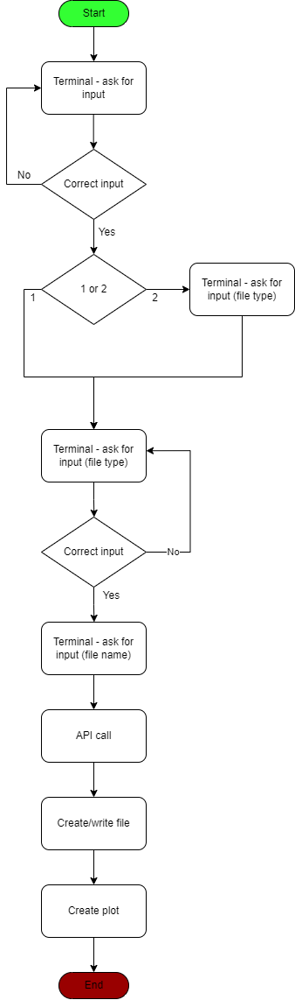

# API patent viewer
## _The world wide pantent view_

API_patent_view is an application for visualisation the patent titles of the two countries Romania and Ukraine.You can extend for many counties as you want. Follow the steps below to explore the project features:

## Program architecture

## Process_flow

## Features

- Create the files were you can store the informations.(txt or csv).

- See the chart-bar of the countries.

## Tech

API_patent_view uses the API's from [PatentsView Comunity](https://patentsview.org/).

A short description from the Welcome page of the site:
>In a data-driven corporate environment, patent information can contribute to the success of an entrepreneur, researcher, or innovator. 
>The PatentsView Community was created to engage and connect interested novices, researchers, and patent experts. 
>This diverse group of people involved in patenting, entrepreneurship, and innovation provides a collaborative environment that fosters creativity and innovation. 

## Installation

API_patent_view requires some python packaging:
- kaleido packaging;
- plotly packaging
- requests packaging
- pandas packaging
- poetry as virtual env

## How to run
- Run the main.py file.
- Run plot-titles.py file.

## Development

Want to contribute? Great!

Make a change in your file and upload it to [Git](https://github.com/Cpopolan/API_patents_view)!

## License

CP

**Free Software, Hell Yeah!**

